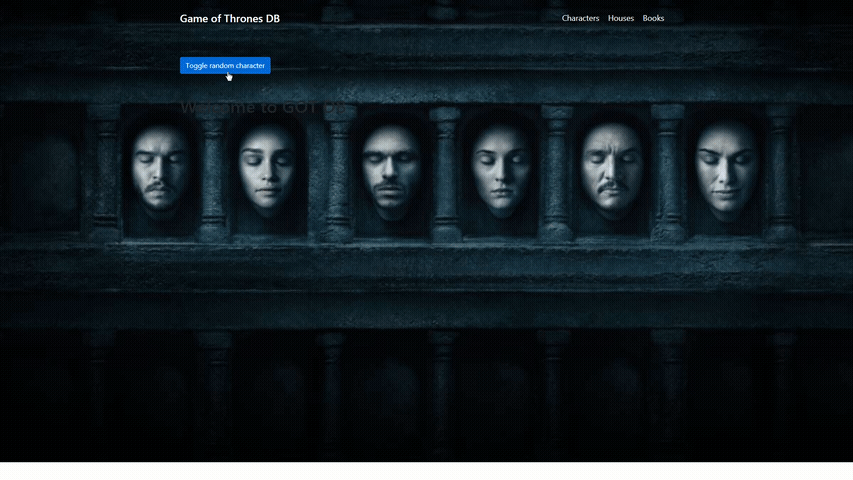

# Game Of Thrones 
> Frontend (app) for API of Ice and Fire 
> 
<a href="https://username1111111111.github.io/Game-of-Thrones/">Live demo here</a>

> 
Or 👇:

## Table of Contents
* [General Info](#general-information)
* [Technologies Used](#technologies-used)
* [Features](#features)
* [Screenshots](#screenshots)
* [Setup](#setup)
* [Usage](#usage)
* [Contact](#contact)

## General Information
- This was done as one of my Udemy learning projects
- It was inteded for practice with:
	- React 
	- React Router
	- PropTypes
	- Higher order components
	- Hooks
	- Decentralized state storage approach (unlike "Dec-Inc-Rnd" app, where centralized)
	- Spinner component
	- Error handling component
	- fetching and parsing data from API of Ice and Fire (server)
	- handling empty fields from API 
	- lifecycle methods
	- unique IDs for \<li> items
- Also for learning various patterns: 
	- render function
	- React.Props.Children
	- functions data-getters from props
	- avoiding copypaste

## Technologies Used
- React
- Reactstrap (Bootstrap for react)
- React Router DOM
- PropTypes
- node-sass
- styled-components
- API of Ice and Fire
- gh-pages (to deploy at github)

## Features
- Displaying random character (and ability to toggle)
- Navigation to characters, books, houses
- Detailed description of choosen character, book or house
- Fetching from API and parsing, error handling, routing

## Screenshots

## Setup
1. Clone the repo  
2. Type in terminal `npm install` inside cloned repo

**To build:**
* `npm build`

## Usage
- Type in terminal `npm start` inside cloned repo
- Enjoy 👍

## Contact

<a style="text-decoration: none;"href="https://github.com/Username1111111111/Username1111111111">@Username1111111111</a>
 
  
The Frontend developer

  💪

